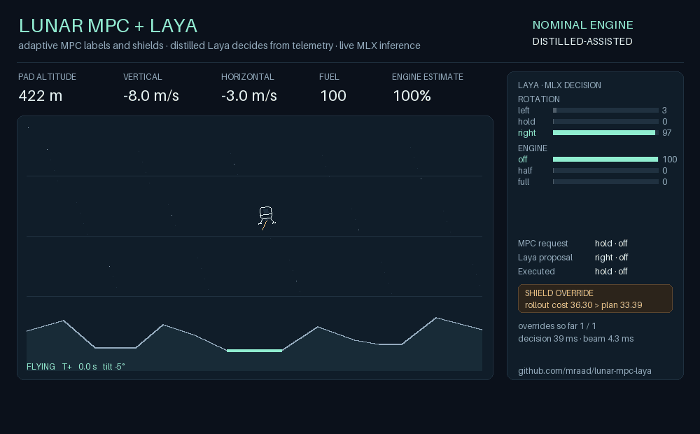

# Lunar MPC + Laya

## In plain terms

**The game.** A small computer game of landing a spacecraft on the Moon.
Three landing pads on bumpy ground. The lander has a tilt control and an
engine with three settings: off, half, full. Every fifth of a second the pilot
picks one tilt and one engine setting. Land gently, upright, on a pad, before
the fuel runs out. To make it hard, partway through the flight the engine
secretly loses more than half its power, and the pilot is not told.

**Two very different pilots.**

- **MPC is the engineer.** It has the physics written down: how gravity
  pulls, how much the engine pushes, where the hills are. Before every move it
  asks "if I do this, then that, then that, where will I be in three seconds?"
  for thousands of combinations, picks the safest, makes one move, then asks
  again. It also watches how the ship actually responds: if the engine feels
  weaker than expected, it lowers its estimate and brakes earlier. It never
  learned anything; a person wrote its rules.
- **Laya is the trainee.** A small AI language model that reads a sentence
  like "altitude 200 m, falling 8 m/s, tilted 3 degrees" and answers two
  multiple-choice questions: which way to tilt, how much engine. It learned by
  watching examples. It has no idea what gravity is. Given good hints it does
  well; given bad hints it crashes.

**Three ways they play together.**

1. **The engineer whispers to the trainee.** Laya's sentence used to end with
   a hint from a simple rule of thumb that assumed a healthy engine. When the
   engine weakened, the hint was wrong, Laya followed it, and crashed every
   time. Swap the hint for MPC's recommendation and the very same Laya lands
   every time, even with the weak engine. Same brain, better advice.
2. **The engineer checks the trainee's work.** Instead of overruling Laya
   every time they disagree, MPC plays Laya's suggestion forward in its head.
   If it looks fine, Laya's choice goes through. If it looks dangerous, MPC's
   choice goes instead. Laya keeps its independence; the engineer keeps a veto.
3. **The trainee learns from the engineer, then flies with a safety net.** A
   new Laya was trained on thousands of MPC's decisions, with the hints removed
   from the sentence, so it must decide on its own. Alone, it crashes every
   flight: one small mistake leads to an unfamiliar situation, then another
   mistake, and so on. With the engineer's veto on, it lands every flight, and
   about two thirds of the moves that fly the ship are Laya's own.

**Why bother, if the engineer alone can land?** The engineer can only do what
its rules say. It cannot be taught new preferences from examples, cannot take
instructions in plain language, and cannot tell you how confident it is. The
trainee can do all three. The goal is a pilot with the trainee's flexibility
and the engineer's guarantee that physics gets the last word. Today that pilot
exists and lands; the next step is more training so the engineer has to step
in less often.

The animation below shows this exact flight: the AI proposing each move, the
engineer vetoing about one in three, the engine failing at ten seconds, and a
soft landing at seventy.



*An actual recorded flight: distilled Laya deciding from telemetry, adaptive
MPC shielding it, engine thrust cut to 40% at 10 s. The shield replaced 109 of
348 proposals. See [docs/media.md](docs/media.md).*

## For the technical reader

Every 0.2 s decision, adaptive MPC (recursive-least-squares thrust estimate +
NumPy beam search over the nine discrete commands, ported from
[lunar-mpc](https://github.com/mraad/lunar-mpc) to the arcade physics of
[lunar-laya](https://github.com/mraad/lunar-laya)) does three jobs:

1. **Guidance**: its first planned command becomes the requested rotation and
   power in Laya's prompt. The template is upstream's, byte for byte, so the
   existing checkpoint needs no retraining. Result at ×0.4 thrust: 0/30 with
   the old PD requests, 30/30 with MPC's.
2. **Shield**: Laya's proposal is forced as the first command of a second beam
   search; it is replaced only when its best rollout costs more than MPC's own
   plan by a margin.
3. **Teacher**: a second checkpoint was fine-tuned on MPC labels with a
   telemetry-only prompt. Raw it lands 0/90; shielded 90/90 with about a third
   of proposals overridden.

A browser page runs the MPC live (click anywhere in the sky, pick a pad, add a
fault, launch). With the local server it also flies both Laya checkpoints and
replays every recorded decision with the model's probabilities.

| Document | Contents |
|---|---|
| [How MPC and Laya combine](docs/fusion.md) | What each side contributes, the three couplings, why the combination is stronger than either, and what comes next |
| [Measured results](docs/results.md) | Landings, request following, shield activity and latency for every pilot and fault scenario, with reproduction commands |
| [Distillation](docs/distillation.md) | Retraining Laya on MPC labels with a telemetry-only prompt: raw 0/90, shielded 90/90 with Laya's choice kept two thirds of the time |
| [Landing lab](web/README.md) | The browser page: live MPC, live Laya pilots through the local server, recorded flights |
| [Animated flight](docs/media.md) | The GIF above: what it shows and how to regenerate it |

## Landing lab in the browser

```bash
HF_HUB_OFFLINE=1 uv run lunar-mpc-laya-serve          # http://127.0.0.1:8767/
```

Pilots on the page: **Browser MPC** (JavaScript port of the controller, no
server needed), **Live Laya** with MPC requests, raw or shielded, and **Live
distilled Laya**, telemetry only, raw or shielded. The recorded tab replays the
evaluation flights after `python3 web/build.py dist/eval/*laya*.json dist/eval/mpc-assisted*.json dist/distilled-evaluation-*.json`.
Without the server, `python3 -m http.server 8767 --bind 127.0.0.1 --directory web`
gives Browser MPC only. Details in [web/README.md](web/README.md).

## Quick start

Requires the sibling `../lunar-laya` checkout (path dependency, like lunar-laya
depends on laya-mlx) and [uv](https://docs.astral.sh/uv/):

```bash
git clone https://github.com/mraad/lunar-laya.git
git clone https://github.com/mraad/lunar-mpc-laya.git
cd lunar-mpc-laya
```
 The MPC modes need
only NumPy; the Laya modes need an Apple Silicon Mac and the `mlx` extra.

```bash
uv sync                                   # MPC-only environment
uv run python -m unittest discover -s tests -v
uv run lunar-mpc-laya --pilot mpc --episodes 10 --seed 3000 --thrust-scale 0.4 \
  --out dist/mpc-fault.json --replay dist/mpc-fault.html
open dist/mpc-fault.html                  # macOS; upstream's standalone replay

uv sync --extra mlx                       # adds laya-mlx and MLX
HF_HUB_OFFLINE=1 uv run lunar-mpc-laya --pilot mpc-assisted \
  --model ../lunar-laya/models/lunar-laya-supervised-mlx \
  --episodes 3 --seed 3000 --thrust-scale 0.4 \
  --out dist/fusion.json --replay dist/fusion.html
```

Pilots: `pd-baseline` and `pd-laya` are upstream's PD guidance for comparison;
`mpc` is MPC alone; `mpc-laya` executes Laya's choices directly with MPC
requests in the prompt; `mpc-assisted` adds the predictive shield. `--fixed-model`
disables learning (ablation), `--thrust-scale` and `--fault-at` set the fault
(default: no fault), `--margin` sets the shield tolerance, `--prompt-estimate`
appends the engine estimate to the prompt (changes the trained template; measured
separately). `uv run lunar-mpc-laya --help` lists the rest.

```text
lunar_mpc_laya/mpc.py     Dynamics (scalar RLS on thrust gain) and AdaptiveMPC (beam search)
lunar_mpc_laya/pilot.py   MPCPilot: upstream Pilot with MPC reference and predictive shield
lunar_mpc_laya/cli.py     Session (episode loop with fault injection), upstream JSON schema and replay
lunar_mpc_laya/distilled.py  telemetry-only prompt and the distilled pilot (Laya decides, MPC shields)
lunar_mpc_laya/serve.py   local server: page + live /reset and /step decisions from the Python pilots
lunar_mpc_laya/gif.py     documentation GIF renderer (Pillow, media extra)
scripts/evaluate.py       records every pilot/scenario on seeds 3000-3009 and writes docs/results.json
scripts/parity.py         records Python flights that the JavaScript port must reproduce
training/                 telemetry-only prompt, MPC-labelled data, CUDA trainer, distilled pilot, MLX verification
tests/test_fusion.py      dependency-free checks (fake agents; no MLX)
web/                      landing lab: lander.js (physics + MPC port), app.js, build.py, Node test
```

## How it works

Every 0.2 s decision the controller reads `Game.snapshot()` and the public map
geometry, never the fault timing or true engine multiplier. `Dynamics.predict`
integrates a constant command with the same ten substeps as `Game.step`, using
the *estimated* thrust gain. `AdaptiveMPC.act` expands every retained candidate
by the nine commands for 15 stages (3 s of foresight), keeps the best 32 by
accumulated cost, and returns the plan, the predicted path and the cost. Safe
touchdown inside the target pad is an absorbing zero-cost state; any other
contact or leaving the world is an absorbing 1000-unit penalty. The cost tracks
pad offset, a lateral-velocity reference, an angle reference, a descent-speed
reference capped by the braking distance the estimated thrust allows (0.7
design margin, as in lunar-mpc), a hold at 120 m above the pad while off it,
plus terrain clearance while off the pad and a small throttle cost.

After each executed command `Dynamics.observe` compares the measured velocity
change with the prediction and updates the thrust gain by scalar recursive
least squares (forgetting 0.97, clipped to [1, 10]). Gravity and turn rate are
treated as known constants: learning gravity too made thrust and gravity
collinear during a sustained upright burn, and the estimates drifted along the
unobservable direction. Coasting, terminal and fuel-starved transitions are
excluded.

The replay is upstream's `replay.html`; its banner reads upstream's `mode`
(`baseline`/`laya`/`assisted`), so the JSON provenance keeps that field and adds
`pilot` (`mpc`, `mpc-laya`, `mpc-assisted`) and a `controller` block. Each
decision record keeps upstream's keys and adds `plan`, `prediction`,
`plan_cost`, `proposal_cost`, `model`, `prediction_error` and `solve_ms`.

## Checks

```bash
uv run python -m unittest discover -s tests -v      # controller, shield, fault harness, server
node --check web/app.js && node web/app.test.cjs   # JS parity with Python, page behaviour
uv run python scripts/parity.py            # after any controller change, then rerun the Node check
```

## Limits

This is an exploration, not a flight-certified controller. The beam search is
incomplete, the cost weights are hand-picked on development seeds 0–9, the
landing model checks contact at stage ends only, fuel starvation is not
predicted, and the shield margin is a design choice, not a certified safe set.
Some starts are unrecoverable for every pilot: for example x = 300 m heading
for the right-hand pad with a ×0.4 fault crashes under MPC alone, so it crashes
shielded too. The shield can only be as good as MPC's own plan.
The original checkpoint receives requested labels in every prompt, so those
Laya results demonstrate request following, not independent piloting, and the
shield never fired. The distilled checkpoint ([docs/distillation.md](docs/distillation.md))
decides from telemetry alone: it cannot land unshielded (0/90) and lands every
flight shielded (90/90) with about a third of its proposals overridden. Appending the engine estimate to the prompt broke request following
completely, so that flag is a negative result, not a feature. The fault is a single step change in main-engine
thrust; sensor noise, delays and other disturbances are untested.

## Related

[lunar-mpc](https://github.com/mraad/lunar-mpc) (adaptive MPC on Box2D),
[lunar-laya](https://github.com/mraad/lunar-laya) (Laya on the arcade lander),
[Laya](https://github.com/NandhaKishorM/laya), [Laya-MLX](https://github.com/mizorewww/laya-mlx).

## License

[Apache-2.0](LICENSE). Copyright 2026 mraad. [NOTICE](NOTICE) records the
attribution; Laya and Laya-MLX retain their upstream terms. The trained
checkpoint lives in lunar-laya and is not redistributed here.
