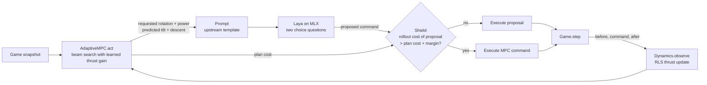

# How MPC and Laya combine

Two controllers with opposite strengths meet at one seam: the text prompt Laya
reads every 0.2 s. This page explains what each side contributes, how the
three couplings work, what the measurements support, and what remains open.

## 1. What each side is good at

| | Adaptive MPC ([lunar-mpc](https://github.com/mraad/lunar-mpc)) | Laya ([lunar-laya](https://github.com/mraad/lunar-laya)) |
|---|---|---|
| Input | Numeric state and public map geometry | A text observation with typed questions |
| Output | The lowest-cost command sequence found, its predicted path and cost | A choice per question, with probabilities and a confidence |
| Knows physics | Yes: thrust, gravity, turn rate, contact rules, terrain | No |
| Looks ahead | 3 s beam search, replanned every decision | No |
| Adapts in flight | Learns the thrust gain from the measured motion | No |
| Learns from data | No; cost weights are hand-picked | Yes: supervised fine-tuning on labelled decisions |
| Explains itself | Plan, predicted path, cost, model estimate | Option probabilities, confidence, the exact prompt |
| Conditioning | Cost terms only | Any instruction or criterion written in the prompt |
| Latency | ~4 ms NumPy, ~1.5 ms JS | ~10 ms on MLX |
| Failure modes | Incomplete search, model mismatch, hand-tuned margins | Template sensitivity, uncalibrated probabilities, no notion of feasibility |

MPC is the part that knows what the vehicle can physically do next. Laya is the
part that can be taught, questioned and conditioned in language. Neither alone
is a complete pilot: MPC has no learning from demonstrations and no language
interface; Laya has no dynamics and can propose an infeasible command with high
confidence.

## 2. The seam: one prompt, one decision

`MPCPilot.decide` runs once per 0.2 s decision:

Three couplings, from strongest to weakest:

1. **MPC writes the requested labels.** Upstream's prompt already carries
   "Requested tilt correction: X. Requested engine power: Y." from a PD law.
   Here the request is the first command of MPC's plan, and the prompt's
   desired tilt and descent speed are MPC's predicted state after that command.
   The template is byte-identical, so the checkpoint that learned to follow PD
   requests follows MPC requests without retraining. MPC's adaptation, terrain
   clearance and braking-distance reasoning enter Laya's decision through the
   words in the prompt.
2. **MPC verifies Laya's proposal.** Upstream overrode every disagreement.
   The predictive shield instead forces Laya's proposal as the first command of
   a second beam search and compares the best achievable cost with MPC's own
   plan. Only a proposal that is predicted to be worse by more than `--margin`
   is replaced. With `--margin 0` a proposal that is merely different but
   equally good survives; with a positive margin Laya gains room to deviate.
   This is what turns "MPC or Laya" into "Laya, checked by MPC".
3. **MPC's estimate is visible to Laya.** Every decision records the thrust
   estimate, and `--prompt-estimate` appends it to the prompt. The current
   checkpoint cannot read it (see §4), so today this coupling exists only in
   the telemetry and the replay.

After the executed command, the simulator's before/after states update MPC's
thrust gain by recursive least squares. Laya never sees the fault directly;
it sees requests that already account for it.

## 3. Why this is the best of both

- **Physical grounding for a language model.** Laya's answers are anchored by
  requests computed from a model that knows the engine's current strength, the
  terrain under the hull and the braking distance the estimated thrust allows.
  A language model fine-tuned on PD labels could not have landed at ×0.4
  thrust; the same weights, fed MPC requests, land 30/30.
- **Learning and language for a model-based controller.** MPC's cost is
  hand-tuned and numeric. Laya's decisions are trained from examples and
  conditioned on the prompt's instructions and criteria, so operator intent
  ("prefer the 4× pad", "land within 60 s", "spare fuel") can be expressed in
  the prompt and learned, rather than encoded as new cost terms. The existing
  training pipeline (`training/data.py` upstream) only needs `guidance()`
  replaced by `MPCPilot` to produce MPC-labelled datasets.
- **Trust, but verify.** The shield keeps Laya's freedom to disagree while
  bounding the cost of a mistake by MPC's own prediction. MPC's plan is always
  the fallback, so the worst case is MPC alone.
- **Adaptation without retraining.** Engine strength changed mid-flight; the
  RLS estimate tracked it within a few seconds, and Laya inherited the
  correction through the prompt. Retraining the model for every fault class is
  unnecessary when the physics layer adapts.
- **Two kinds of explanation.** Every recorded decision holds MPC's plan,
  predicted path, cost and estimate, and Laya's probabilities, confidence and
  the exact prompt. A failure can be attributed to the request, to the
  proposal, or to the shield.

## 4. What the measurements support, and what they do not

Full tables: [results.md](results.md).

- Laya with MPC requests landed 30/30 in every scenario, including ×0.4 thrust
  where Laya with PD requests landed 0/30. The fusion works.
- The trained checkpoint matched every one of 28,025 MPC requests. That means
  the Laya flights are identical to the MPC-only flights, and the shield never
  fired. The evidence shows faithful request following, not independent
  piloting; the shield's correctness rests on a unit test with a deliberately
  bad proposal.
- Appending one sentence with the thrust estimate to the prompt broke request
  following completely (0 of 2,864 matches). The checkpoint is tied to its
  exact training template. Coupling 3 needs retraining before it can matter.
- Fixed-model MPC landed 30/30 at ×0.7 but 0/30 at ×0.4. Replanning alone
  covers mild faults; adaptation is what covers severe ones.

## 5. Distillation: the shield at work

Step 1 of the original plan is done; see [distillation.md](distillation.md).
Laya retrained on MPC labels with a telemetry-only prompt reaches 90%
per-question validation accuracy, lands 1 of 90 unshielded flights (errors
compound once it leaves the teacher's trajectory), and lands 90/90 with the
shield while keeping more than four fifths of its own choices. That is the
first configuration where the fused pilot is neither controller alone, and the
accuracy that did nothing for the raw pilot shows up as less shield work.

## 6. Where it goes next

1. **DAgger.** Roll out the shielded pilot, relabel visited states with MPC,
   retrain; the student learns near its own mistakes.
2. **Laya as a prior in the beam.** Add `-λ · log p(command)` from Laya's
   probabilities to the stage cost so MPC's search prefers what the model
   would do, while physics still vetoes the infeasible.
3. **Hierarchy.** Give Laya the decisions that are not physics: which pad,
   whether to abort, how aggressive to be. Typed questions fit those better
   than a 5 Hz throttle choice, and MPC executes whatever it decides.
4. **Calibration.** Fit temperatures on held-out MPC labels so confidence can
   set the shield margin instead of a fixed number.
5. **Re-train with the estimate in the prompt**, so coupling 3 can be tested.

None of this is flight software. The search is incomplete, the cost is
hand-picked, the landing model checks contact at stage ends, and the shield
margin is a design choice, not a certified safe set.
